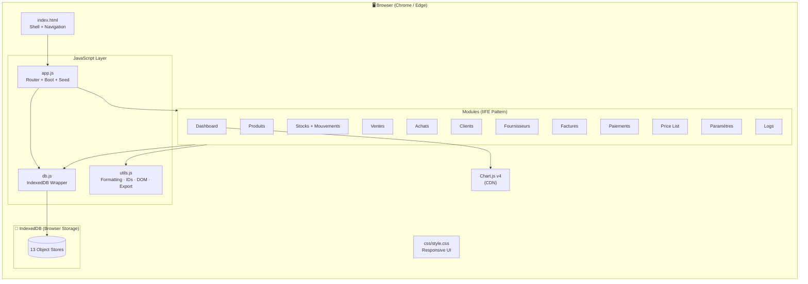
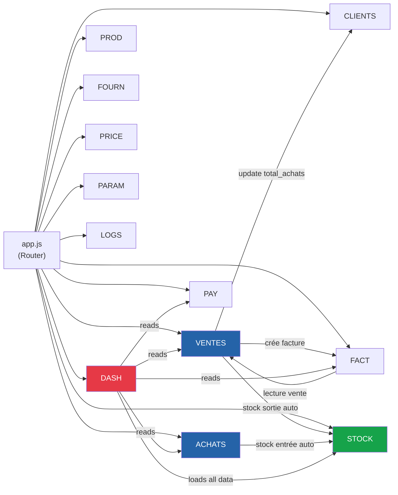
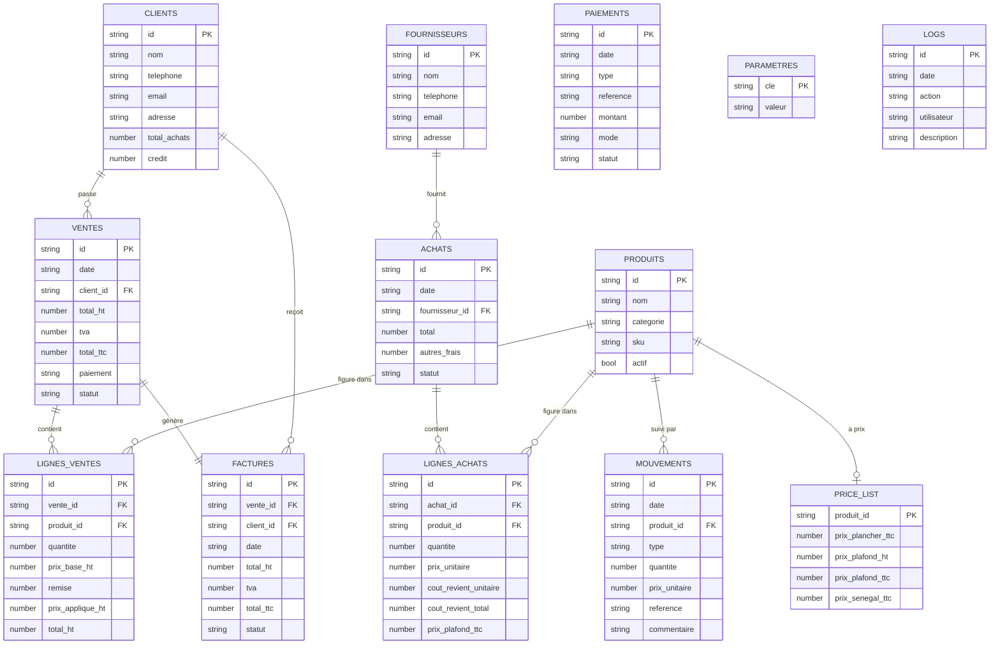
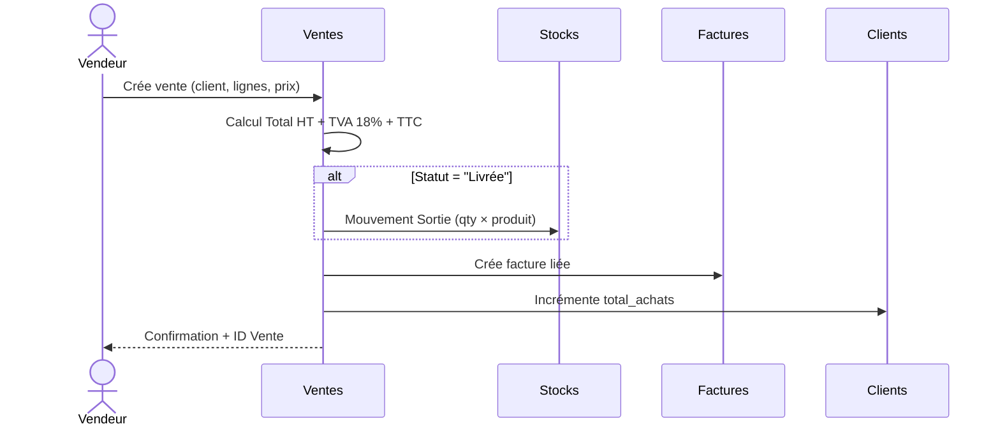
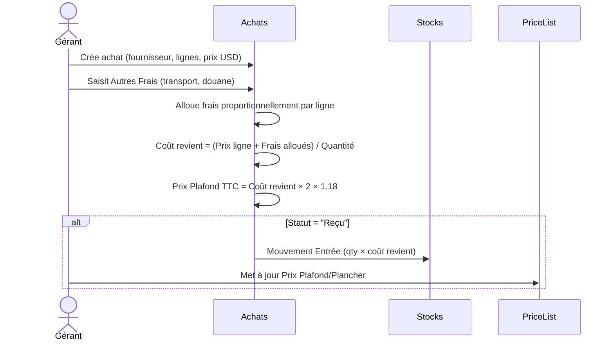
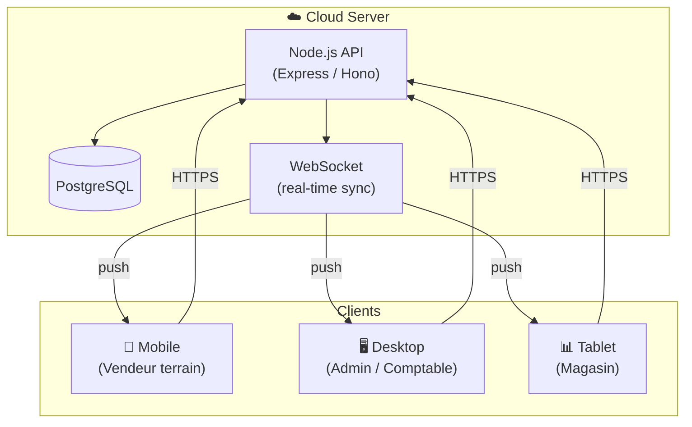

# USA PARTS AUTO ERP — Architecture

> This document describes the technical architecture of v1.0 and the intended evolution through v2.0.
> All diagrams use [Mermaid](https://mermaid.js.org/) syntax and render natively on GitHub.

---

## 1. System Overview



---

## 2. Module Dependency Graph



---

## 3. Data Model (Entity Relationships)



---

## 4. Key Business Logic Flows

### 4a. Cycle de Vente → Stock



### 4b. Cycle d'Achat → Landed Cost → Stock



### 4c. Calcul du Stock Actuel

```
Stock Actuel (produit X) =
    SUM(mouvements WHERE produit_id = X AND type = "Entrée").quantite
  − SUM(mouvements WHERE produit_id = X AND type = "Sortie").quantite
```

> Il n'y a pas de colonne "stock" en base. Le stock est **toujours recalculé** depuis le journal des mouvements. Cela garantit un audit trail complet et l'impossibilité de désynchronisation.

---

## 5. File Structure

```
USA-PARTS-AUTO-ERP/
├── index.html              Shell HTML — navigation + modales + zones print
├── .gitignore
├── assets/
│   └── logo.png
├── css/
│   └── style.css           Tous les styles — variables CSS, responsive, print
├── js/
│   ├── db.js               Abstraction IndexedDB (open, get, put, add, delete, putMany, clear)
│   ├── utils.js            Fonctions partagées : formatage, IDs, DOM, toast, modal, CSV export
│   ├── app.js              Routeur hash-based, boot, seed des données démo
│   └── modules/
│       ├── dashboard.js    KPIs + Chart.js
│       ├── produits.js
│       ├── stocks.js       renderStocks + renderMouvements + computeStocks
│       ├── ventes.js       + lignes_ventes inline
│       ├── achats.js       + lignes_achats + landed cost
│       ├── clients.js
│       ├── fournisseurs.js
│       ├── factures.js     + print HTML
│       ├── paiements.js
│       ├── pricelist.js
│       └── parametres.js   + Logs (dans le même fichier)
├── docs/
│   ├── phases.md           ← Ce document de roadmap
│   ├── architecture.md     ← Ce document
│   └── north-star.md       ← Vision produit
└── tests/
    ├── runner.html         Test runner navigateur
    ├── framework.js        Runner minimaliste (~60 lignes)
    ├── utils.test.js
    ├── db.test.js
    ├── stocks.test.js
    ├── ventes.test.js
    └── achats.test.js
```

---

## 6. Architectural Constraints & Rationale

| Constraint | Reason |
|---|---|
| **No build step** | Zero dev toolchain required. Any text editor + browser is enough. |
| **IIFE module pattern** | Encapsulation without ES modules (which require a server for `import`). Each module exposes a single object. |
| **IndexedDB, not localStorage** | localStorage is synchronous, limited to ~5MB, and stores only strings. IndexedDB handles large datasets and complex objects. |
| **Stock computed from movements** | A stored stock count can drift if any operation fails. Computing from the immutable movement log is always correct. |
| **No ORM** | Direct IndexedDB calls keep the data layer transparent and debuggable without abstraction overhead. |
| **Chart.js via CDN** | Single well-known dependency, no install, version-pinned URL. |

---

## 7. v2.0 Target Architecture


